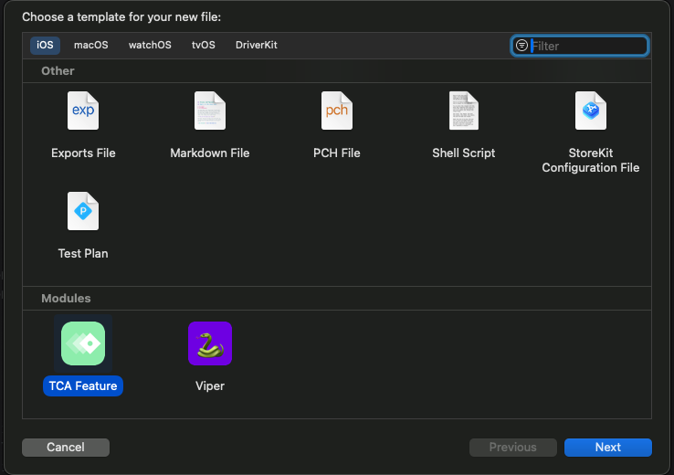
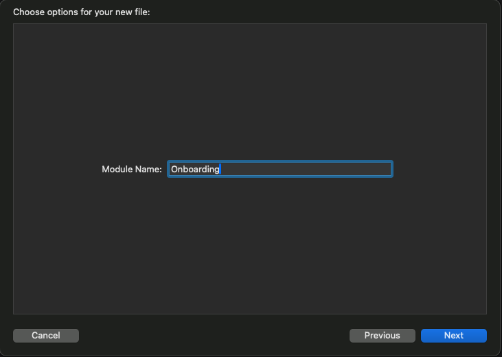
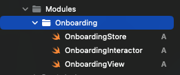

Xcode custom template for effortlessly creating a Composable Architecture feature.<br/>
With this template, you'll find yourself equipped with essential boilerplate code tailored to your needs, all conveniently incorporating the module name into relevant structs.

## Overview

This template is designed to streamline your workflow by integrating seamlessly with [The Composable Architecture](https://github.com/pointfreeco/swift-composable-architecture), a powerful architectural pattern for Swift projects.

<p align="center">
  
  
  
</p>

## Key Features

- [x] **View**: Responsible for presenting the UI and dispatching user actions to the store.
- [x] **Store**: Houses the business logic and state mutations, adhering to The Composable Architecture principles.
- [x] **Interactor**: Acts as a mediator, managing the feature's dependencies and facilitating their interaction with the store.

## Installation

### Terminal
To install the module templates via terminal, execute the following command:

```
curl "https://raw.githubusercontent.com/TelemTobi/Viper-Module-Template/main/install_template.sh" | bash
```

### Manual
If you prefer a manual installation process, follow these steps:

Download the repository.
Run the `install.template.sh` file in your terminal:

```
sh <PATH_TO_SHELL_FILE>
```

Alternatively, move the TCA Feature.xctemplate directory to:

```
/Applications/Xcode.app/Contents/Developer/Library/Xcode/Templates/File Templates/Modules
```
<br/>

And you're all set to leverage the power of Composable Architecture! 🚀
